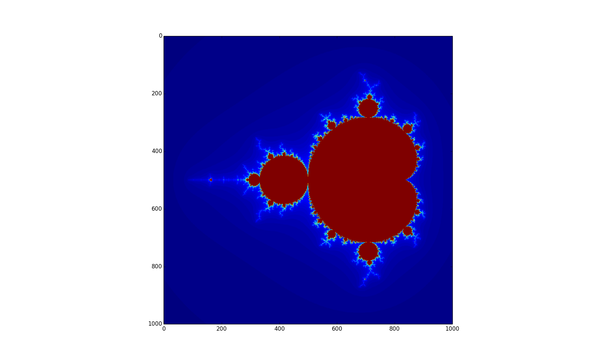
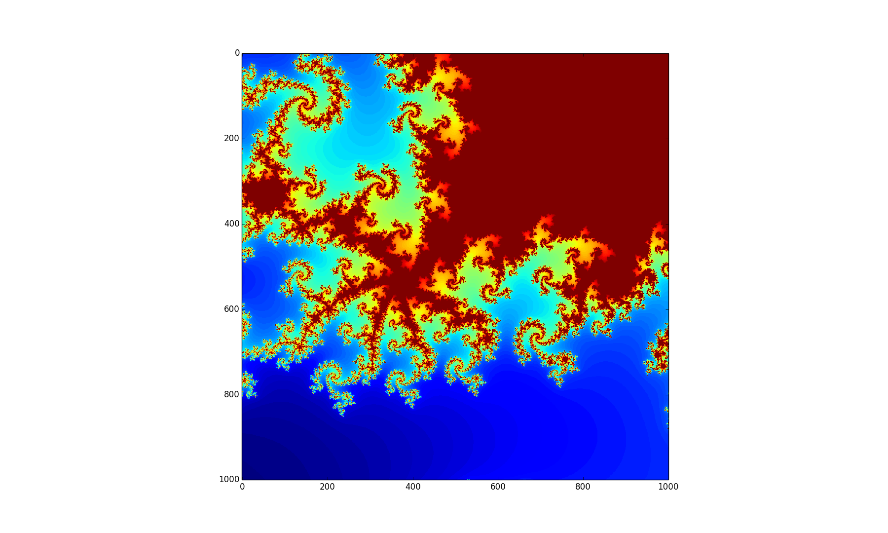
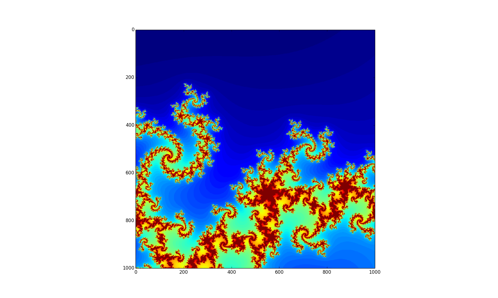

# Mandelbrot Set
A simple Python script to plot the Mandelbrot Set.

## What is the Mandelbrot Set?
From Wikipedia:
```
The Mandelbrot set is the set of complex numbers c for which the function f(z)=z^2+c does not diverge when iterated from z=0.
```

### An image of the set


### Zoomed In


### More Zoomed In


Check out [https://en.wikipedia.org/wiki/Mandelbrot_set](https://en.wikipedia.org/wiki/Mandelbrot_set) to learn more about it.

## Acknowledgments
Shout out to Tariq Rashid and his great [book](https://www.amazon.com/Make-Your-Mandelbrot-Tariq-Rashid/dp/1500552968/ref=sr_1_4?ie=UTF8&qid=1480579504&sr=8-4&keywords=mandelbrot) for introducing me to the Mandelbrot Set!!
